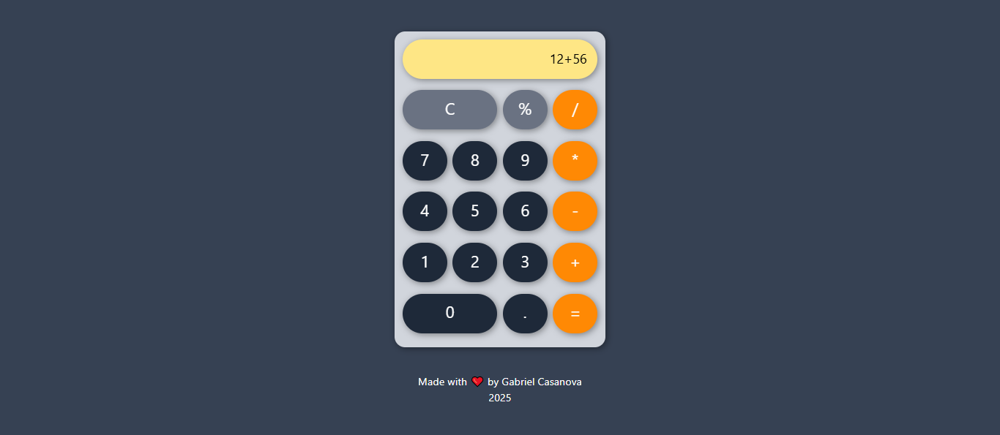

# reactstudies
⚛️📝 Repository created to store my React study projects

- **React-App**
  - Simple 'hello-world' type app to test react features.

- **Calc-App**
  - Simple calculator. Made using Tailwind
  - 

- **ToDo-App**
  - Task manangeament app. Supports multiple lists of tasks created by the user and saved in the browser's local storage. User can save their tasks and group them in the complete/incomplete categories.
  - Made using tailwind and react-router.
https://github.com/user-attachments/assets/cfb23e5d-c0dc-4056-8e23-c90c3ba1af05
